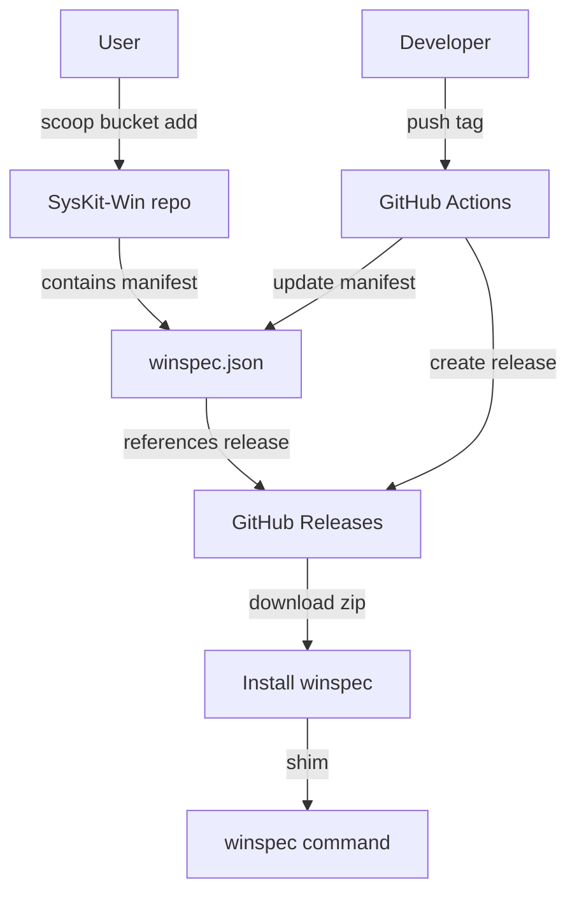
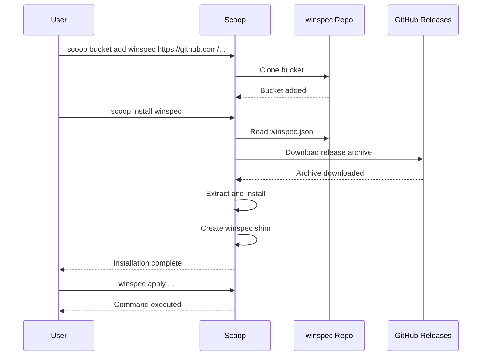

# Scoop Bucket Plan for WinSpec

## Overview

Create a Scoop bucket inside the main WinSpec repository, allowing users to install WinSpec via Scoop with a simple command. The bucket manifest will be auto-updated via GitHub Actions when releases are published.

## Repository Information

- **Main Project (GitHub)**: `https://github.com/lvyuemeng/winspec`
- **Mirror (Codeberg)**: `https://codeberg.org/nostalgia/winspec` (auto-mirrored)
- **Versioning**: Git tags

## Architecture



## Files to Create

### 1. Repository Structure

```
winspec/
├── winspec.json        # Scoop manifest at root
├── README.md           # Updated with Scoop instructions
├── winspec/            # Main project files
├── docs/
└── .github/
    └── workflows/
        ├── codeberg.yml      # Existing mirror workflow
        └── release.yml       # New: Create release + update manifest
```

### 2. Scoop Manifest - winspec.json

The manifest will be placed at the repository root and will:
- Download WinSpec from GitHub releases based on git tags
- Install to Scoop apps directory
- Create a shim for `winspec.ps1` to make `winspec` command available globally
- Persist user specs and configuration

**Key manifest properties:**

| Property | Value |
|----------|-------|
| `version` | Dynamic from git tag |
| `description` | A composable, declarative Windows configuration system |
| `homepage` | https://github.com/user/SysKit-Win |
| `license` | MIT |
| `url` | Download from GitHub release archive |
| `bin` | Shim winspec.ps1 as winspec |
| `persist` | specs folder for user configurations |
| `checkver` | GitHub API for latest tag |
| `autoupdate` | Auto-generate download URL |

### 3. Installation Commands for Users

```powershell
# Add the bucket (from GitHub)
scoop bucket add winspec https://github.com/lvyuemeng/winspec

# Or from Codeberg mirror
scoop bucket add winspec https://codeberg.org/nostalgia/winspec

# Install WinSpec
scoop install winspec

# Use WinSpec
winspec apply -Spec ~/.config/winspec/specs/default.ps1
```

### 4. Release Workflow

A GitHub Actions workflow that:
1. Triggers when a new tag is pushed (e.g., `v0.1.0`)
2. Creates a GitHub release with archive
3. Updates `winspec.json` with the new version
4. Commits and pushes the updated manifest

## Implementation Steps

### Step 1: Create Scoop Manifest

Create `winspec.json` at the repository root:

```json
{
    "version": "v0.1.0",
    "description": "A composable, declarative Windows configuration system",
    "homepage": "https://github.com/lvyuemeng/winspec",
    "license": "MIT",
    "url": "https://github.com/lvyuemeng/winspec/archive/refs/tags/v0.1.0.zip",
    "extract_dir": "winspec-v0.1.0",
    "bin": "winspec/winspec.ps1",
    "persist": "winspec/specs",
    "checkver": "github",
    "autoupdate": {
        "url": "https://github.com/lvyuemeng/winspec/archive/refs/tags/$version.zip",
        "extract_dir": "winspec-$version"
    }
}
```

**Note:** Version includes the 'v' prefix (e.g., `v0.1.0`) to match git tags.

### Step 2: Create Release Workflow

Create `.github/workflows/release.yml`:

```yaml
name: Create Release

on:
  push:
    tags:
      - 'v*'

jobs:
  release:
    runs-on: ubuntu-latest
    steps:
      - uses: actions/checkout@v4
      
      - name: Get version from tag
        id: get_version
        run: echo "VERSION=${GITHUB_REF#refs/tags/}" >> $GITHUB_OUTPUT
      
      - name: Create GitHub Release
        uses: softprops/action-gh-release@v1
        with:
          generate_release_notes: true
      
      - name: Update Scoop manifest
        run: |
          VERSION=${{ steps.get_version.outputs.VERSION }}
          # Update winspec.json with new version
          # (using jq or sed to update version, url, extract_dir)
      
      - name: Commit updated manifest
        run: |
          git config user.name "github-actions[bot]"
          git config user.email "github-actions[bot]@users.noreply.github.com"
          git add winspec.json
          git commit -m "chore: update scoop manifest for ${{ steps.get_version.outputs.VERSION }}"
          git push
```

### Step 3: Update Main Project README

Add Scoop installation method to the main README.md:

```markdown
### Install via Scoop (Recommended)

```powershell
# Add the bucket
scoop bucket add winspec https://github.com/lvyuemeng/winspec

# Install WinSpec
scoop install winspec

# Verify installation
winspec help
```

### Step 4: Create Initial Release

Create the first git tag to trigger the release workflow:

```bash
git tag v0.1.0
git push origin v0.1.0
```

## User Experience Flow



## Benefits

1. **Single Repository**: No need for separate bucket repo
2. **Easy Installation**: Single command installation
3. **Auto Updates**: `scoop update winspec` gets latest version
4. **Path Management**: Automatic shim creation
5. **Version Control**: Users can install specific versions
6. **Persistence**: User specs survive updates
7. **Automated**: GitHub Actions handles manifest updates

## Notes

- The Codeberg mirror will automatically receive the updated manifest via the existing `codeberg.yml` workflow
- Users can add the bucket from either GitHub or Codeberg
- The manifest uses `checkver: github` for automatic version detection

## Next Steps

1. Create `winspec.json` manifest at repository root
2. Create `.github/workflows/release.yml` for automated releases
3. Update `README.md` with Scoop installation instructions
4. Create initial git tag to test the workflow
